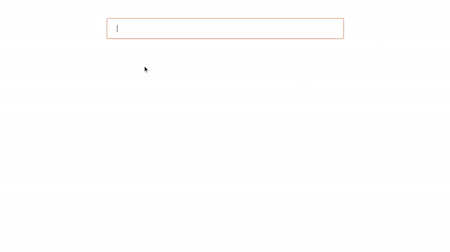

# ReactJS - Email Component

ReactJS based Email component, provides input field to add single / multiple emails with validation. The email value is automatically validated on blur event. You can change validation message using props. You can also disable email field using disable props.

## Table of contents

- [Browser Support](#browser-support)
- [Demo](#demo)
- [Getting started](#getting-started)
- [Usage](#usage)
- [Available Props](#available-props)
- [Methods](#methods)
- [Want to Contribute?](#want-to-contribute)
- [Collection of Components](#collection-of-components)
- [Changelog](#changelog)
- [License](#license)
- [Keywords](#Keywords)

## Browser Support

|  |  |  |  |  |
| ---------------------------------------------------------------------------------------- | ------------------------------------------------------------------------------------------- | ---------------------------------------------------------------------------------------- | ---------------------------------------------------------------------------------- | ---------------------------------------------------------------------------------------------------------------------------- |
| 83.0 ✔                                                                                   | 77.0 ✔                                                                                      | 13.1.1 ✔                                                                                 | 83.0 ✔                                                                             | 11.9 ✔                                                                                                                       |

## Demo

[](https://github.com/weblineindia/ReactJS-Email/email.gif)

## Getting started

Install the npm package:

```bash
npm install react-weblineindia-email
#OR
yarn add react-weblineindia-email
```

## Usage

Use the `<react-weblineindia-email>` component:

```js
import React ,{ Component } from 'react';
import Email from 'react-weblineindia-email'
class Test extends Component {
constructor(props) {
    super(props);
    this.state = {
      emailValue:[{email:""}]
    };
  }
    onMultipleEmail() {
        this.state.emailValue.push({
        email: "",
        });
    }
    onChange(event, index) {
        debugger;
        let value = this.state.emailValue;
        value[index].email = event.target.value;
        this.setState({
        emailValue: value,
        });
    }
    render() {
    return (
      <div className="App">
        {this.state.emailValue.map((item, i) => {
          return (
            <div key={i}>
              <Email
                isShowPlus={this.state.emailValue.length - 1 === i}
                value={this.state.emailValue}
                index={i}
                onMultipleEmail={this.onMultipleEmail.bind(this)}
                onChange={this.onChange.bind(this)}
              />
            </div>
          );
        })}
      </div>
    );
  }
}
export default Test;

```

## Available Props

| Prop                | Type          | default                 | Description                                   |
| ------------------- | ------------- | ----------------------- | --------------------------------------------- |
| maxlength           | Number        | 50                      | maxlength for email                           |
| id                  | String        |                         | email id                                      |
| emailFormateError   | String        | Email is not valid      | email formate validation                      |
| duplicateEmailError | String        | Do not enter same email | duplicate email error                         |
| onMultipleEmail     | Function      |                         | when click on plus icon on email              |
| name                | String        | email                   | email name.                                   |
| index               | Number        | 0                       | email index.                                  |
| values              | Array[Object] | [{email : ''}]          | email default array                           |
| isMultiple          | Boolean       | true                    | flag to implement multiple email              |
| isShowPlus          | Boolean       | false                   | flag to show plus icon for add multiple email |
| placeholder         | String        | Email                   | email placeholder                             |
| disabled            | Boolean       | false                   | disable input field                           |
| tabindex            | Number        | 0                       | email tabIndex                                |

## Methods

| Name        | Description                                         |
| ----------- | --------------------------------------------------- |
| focus       | Gets triggered when the input field receives focus. |
| blur        | Gets triggered when the input field loses focus.    |
| inputChange | Gets triggered every time input got changed.        |

## Want to Contribute?

- Created something awesome, made this code better, added some functionality, or whatever (this is the hardest part).
- [Fork it](http://help.github.com/forking/).
- Create new branch to contribute your changes.
- Commit all your changes to your branch.
- Submit a [pull request](http://help.github.com/pull-requests/).

---

## Collection of Components

We have built many other components and free resources for software development in various programming languages. Kindly click here to view our [Free Resources for Software Development](https://www.weblineindia.com/software-development-resources.html)

---

## Changelog

Detailed changes for each release are documented in [CHANGELOG.md](./CHANGELOG.md).

## License

[MIT](LICENSE)

[mit]: https://github.com/weblineindia/ReactJS-Email/blob/master/LICENSE

## Keywords
 
react-weblineindia-email, react-email, reactjs-email, email-component, email-validation, react-mail-validation
